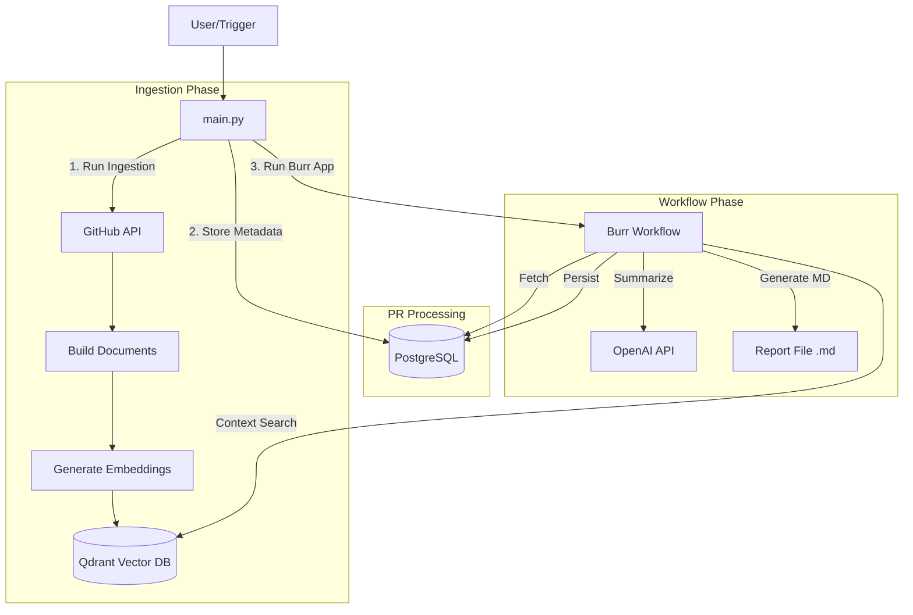

# System Design & Architecture

## Overview
The **Github Agent** is an automated system designed to ingest GitHub Pull Requests (PRs), analyze their content using LLMs (Large Language Models) and RAG (Retrieval-Augmented Generation), and generate comprehensive Markdown reports.

The system uses a state machine workflow to manage the lifecycle of PR processing, from fetching metadata to persisting the final report.

## Architecture Components

### 1. **Ingestion Layer** (`ingestion/`)
- **Purpose**: Fetches raw code and file structures from GitHub repositories.
- **Components**:
  - `github_api.py`: Handles interactions with the GitHub API (fetching tree, file content, PR details).
  - `document.py`: Converts raw file content into `Document` objects suitable for indexing.
  - `splitter.py`: chunks large code files into manageable nodes (using `SentenceSplitter` or similar).

### 2. **Data Storage Layer**
- **Vector Database (Qdrant)**:
  - Stores high-dimensional embeddings of the code chunks.
  - Supports semantic search to find relevant context for PRs (e.g., "What is the purpose of this file?", "What depends on this?").
  - Managed via `vector_store.py`.
- **Relational Database (PostgreSQL)**:
  - Stores PR metadata (Author, Title, Stats) and the generated reports.
  - Managed via SQLAlchemy models (`database.py`, `db.py`).

### 3. **Workflow Engine (`burr_workflow.py`)**
- **Library**: Uses [Burr](https://github.com/DAGWorks-Inc/burr) to define a state machine.
- **Steps**:
  1.  **Fetch PR Metadata**: Reads PRs from the database (populated by `main.py`).
  2.  **Collect Context**: Queries Qdrant for semantic context related to the changed files.
  3.  **Summarize Changes**: Uses OpenAI (GPT-4o-mini) to generate summaries and impact analysis.
  4.  **Generate Report**: Formats the analysis into a Markdown document.
  5.  **Persist Report**: Saves the generated report back to PostgreSQL.

### 4. **AI & LLM Integration (`llm_client.py`)**
- Uses OpenAI API for:
  - **Embeddings**: `text-embedding-3-small` for vectorizing code.
  - **Generation**: `gpt-4o-mini` for understanding diffs and summarizing impact.

## Data Flow

## Docker Architecture
The system is containerized using Docker Compose:
- **`app`**: The Python application container (running `main.py`).
- **`qdrant`**: The vector database service on port 6333.
- **`db`**: The PostgreSQL database service on port 5432.
